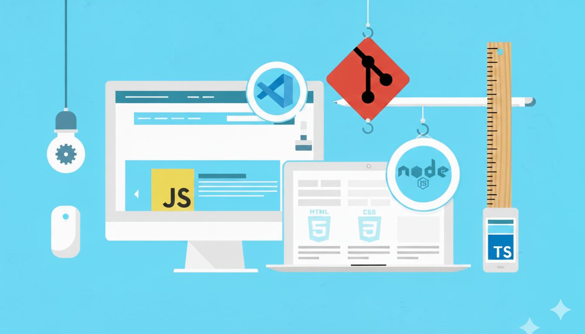

# Jornada Frontend: Fundamentos para Angular

  
  
<em>Construindo uma base sólida em tecnologias web fundamentais</em>

Este repositório documenta meu progresso e aprendizado no curso **Web Frontend Completo: HTML, CSS, JS, TS, React e Next 2025**, ministrado pelos instrutores Jamilton Damasceno e Jorge Sant Ana. Disponibilizado na plataforma Udemy.

O conteúdo aqui presente representa os projetos e exercícios práticos desenvolvidos ao longo das seções, servindo como um registro prático dos meus estudos.

## 🎯 Objetivo Principal

O objetivo central deste estudo é construir uma base sólida e aprofundada nas tecnologias fundamentais do desenvolvimento web — **HTML, CSS, JavaScript e TypeScript**. Este conhecimento servirá como alicerce para estudos futuros e especialização no framework **Angular**.

---

## 🎓 Sobre o Curso

- **Curso:** [Web Frontend Completo: HTML, CSS, JS, TS, React e Next 2025](https://www.udemy.com/course/web-frontend-completo-html-css-javascript-typescript-react-next/)
- **Instrutores:** Jamilton Damasceno e Jorge Sant Ana
- **Plataforma:** Udemy
- **Foco deste Repositório:** Módulos de HTML5, CSS3, JavaScript (ES6+) e TypeScript.

O curso oferece uma formação abrangente, e este repositório é dedicado a registrar a jornada através de suas seções fundamentais, essenciais para qualquer desenvolvedor frontend.

> **⚠️ Nota Importante:** As seções 32 a 35 (React, Next, Figma e AirBnb) não serão abordadas neste momento, pois o foco atual é estabelecer uma base técnica sólida nos conceitos fundamentais que servirão como fundação para o aprendizado posterior do framework Angular.

---

## 🚀 Tecnologias e Conceitos Abordados

A estrutura de aprendizado seguirá a progressão do curso, focando nos seguintes pilares:

- ### **HTML5 Semântico**
  - Estruturação correta de páginas web.
  - Uso de tags semânticas para acessibilidade e SEO.
  - Formulários e elementos de mídia.

- ### **CSS3 e Design Responsivo**
  - Seletores avançados e especificidade.
  - **Flexbox** e **CSS Grid** para layouts modernos.
  - Técnicas de responsividade com Media Queries.
  - Efeitos visuais e animações.

- ### **JavaScript (ES6+)**
  - Manipulação do DOM (Document Object Model).
  - Lógica de programação, tipos de dados e estruturas de controle.
  - Funções, objetos e arrays.
  - Assincronismo: Promises, `async/await`.
  - Conceitos modernos do ES6+ (arrow functions, classes, modules, etc.).

- ### **TypeScript**
  - Tipagem estática para JavaScript.
  - Interfaces, types, enums e classes.
  - Generics e conceitos avançados de tipagem.
  - Configuração do ambiente com `tsconfig.json`.

---

## 🏆 Projetos Práticos

| Projeto | Status | Descrição                                                                                                                                                                                                           |
| ------- | ------ | ------------------------------------------------------------------------------------------------------------------------------------------------------------------------------------------------------------------- |
| 01      | ✅     | **Classificação de Animes** → Usando HTML crie uma estrutura para classificar os melhores animes                                                                                                                    |
| 02      | ✅     | **Site Oficial do Discord** → Use HTML para criar o famoso site Discord                                                                                                                                             |
| 03      | ⏳     | **Detalhes produto Loja Virtual** → Usando HTML e CSS criaremos uma área muito comum em lojas virtuais, exibição das informações de produtos                                                                        |
| 04      | ⏳     | **Site Anna Bella** → Site completo com HTML e CSS, aplicando formatações e navegação entre páginas                                                                                                                 |
| 05      | ⏳     | **Site Oficial do Medium** → Usando HTML e CSS recriaremos a página inicial do famoso Medium, vendo conceitos práticos de desenvolvimento                                                                           |
| 06      | ⏳     | **Barra de navegação vertical** → Crie do zero um dos recursos mais usados na criação de site, uma barra de navegação vertical, usando HTML e CSS                                                                   |
| 07      | ⏳     | **Página inicial do Zoom** → Recriaremos a página inicial do Zoom usando GridLayout para organizar os conteúdos e Flexbox para organizar os itens internos, trabalhando conceitos de responsividade e Media Queries |
| 08      | ⏳     | **Álcool ou Gasolina** → Usando Javascript você vai criar um projeto que o usuário coloca o preço do Álcool e da Gasolina e a aplicação diz qual combustível é melhor utilizar                                      |
| 09      | ⏳     | **Frases motivacionais** → Uma aplicação Javascript que exibe frases motivacionais diariamente                                                                                                                      |

---

## 📚 Progresso no curso

### Seção 1: Boas Vindas (4 aulas - 20m)

| Aula | Status | Descrição                        |
| ---- | ------ | -------------------------------- |
| 001  | ✅     | Boas vindas                      |
| 002  | ✅     | Como obter o melhor do curso     |
| 003  | ✅     | Redes sociais                    |
| 004  | ✅     | Youtube e Comunidade no WhatsApp |

### Seção 2: Configuração de Ambiente (6 aulas - 55m)

| Aula | Status | Descrição                        |
| ---- | ------ | -------------------------------- |
| 005  | ✅     | Introdução à seção               |
| 006  | ✅     | Softwares: Instalação no Windows |
| 007  | ✅     | Softwares: Instalação no MacOS   |
| 008  | ✅     | Softwares: Instalação no Linux   |
| 009  | ✅     | VS Code: Configurações e Outros  |
| 010  | ✅     | VS Code: Conhecendo o software   |

### Seção 3: Desenvolvimento Web Front-End (2 aulas - 24m)

| Aula | Status | Descrição                              |
| ---- | ------ | -------------------------------------- |
| 011  | ✅     | Como a internet funciona na realidade? |
| 012  | ✅     | Como os sites funcionam na realidade?  |

### Seção 4: Introdução ao HTML (10 aulas - 1h 48m)

| Aula | Status | Descrição                                 |
| ---- | ------ | ----------------------------------------- |
| 013  | ✅     | O que é HTML?                             |
| 014  | ✅     | HTML, CSS e JavaScript: A tríade perfeita |
| 015  | ✅     | Anatomia da TAG (Teoria)                  |
| 016  | ✅     | Anatomia da TAG (Prática)                 |
| 017  | ✅     | Estrutura: O que são Páginas da Web?      |
| 018  | ✅     | Console do Desenvolvedor                  |
| 019  | ✅     | Cabeçalhos: Elementos de título HTML      |
| 020  | ✅     | Elementos de parágrafos HTML              |
| 021  | ✅     | Semântica e formatação de textos          |
| 022  | ✅     | [Projeto] Classificação de Animes         |

### Seção 5: HTML Intermediário (7 aulas - 2h 1m)

| Aula | Status | Descrição                            |
| ---- | ------ | ------------------------------------ |
| 023  | ✅     | O Elemento de Lista                  |
| 024  | ✅     | Imagens: Elementos de Imagem         |
| 025  | ✅     | Imagens: Caminho Relativo e Absoluto |
| 026  | ✅     | Links: Elementos de Âncora           |
| 027  | ✅     | Links: Mais sobre as Âncoras         |
| 028  | ✅     | Tabelas: Elementos de Tabela         |
| 029  | ✅     | Tabelas: Estrutura Semântica         |

### Seção 6: HTML - Formulários e Mídias (9 aulas - 2h 22m)

| Aula | Status | Descrição                               |
| ---- | ------ | --------------------------------------- |
| 030  | ✅     | Formulários: Introdução                 |
| 031  | ✅     | Formulários: Entendendo na prática      |
| 032  | ✅     | Formulários: Descobrindo mais elementos |
| 033  | ✅     | Formulários: Exercício 1                |
| 034  | ✅     | Formulários: Exercício 2                |
| 035  | ✅     | HTML: Caracteres especiais              |
| 036  | ✅     | Mídias: Executar vídeos c/ HTML         |
| 037  | ✅     | VS Code: Emmet                          |
| 038  | ✅     | [Projeto] Site Oficial do Discord       |

### Seção 7: Introdução ao CSS (3 aulas - 51m)

| Aula | Status | Descrição                        |
| ---- | ------ | -------------------------------- |
| 039  | ✅     | Por que precisamos de CSS?       |
| 040  | ✅     | Entendendo conceitos importantes |
| 041  | ✅     | Como adicionar e aplicar CSS     |

### Seção 8: Propriedades CSS (9 aulas - 2h 29m)

| Aula | Status | Descrição                               |
| ---- | ------ | --------------------------------------- |
| 042  | ⏳     | Div e Span (Teoria)                     |
| 043  | ⏳     | Div e Span (Prática) - Parte 1          |
| 044  | ⏳     | Div e Span (Prática) - Parte 2          |
| 045  | ⏳     | Fontes e Cores (Teoria)                 |
| 046  | ⏳     | Fontes e Cores (Prática)                |
| 047  | ⏳     | Modelo de caixa                         |
| 048  | ⏳     | Bordas                                  |
| 049  | ⏳     | Margin e Padding                        |
| 050  | ⏳     | [PROJETO] Detalhes produto Loja Virtual |

### Seção 9: CSS Intermediário (18 aulas - 4h 50m)

| Aula | Status | Descrição                                        |
| ---- | ------ | ------------------------------------------------ |
| 051  | ⏳     | Classes e IDs (Teoria)                           |
| 052  | ⏳     | Classes e IDs (Prática)                          |
| 053  | ⏳     | Classes e IDs (Exercício)                        |
| 054  | ⏳     | Cascatas, Herança                                |
| 055  | ⏳     | Unidades de medidas CSS - Parte 1                |
| 056  | ⏳     | Unidades de medidas CSS - Parte 2                |
| 057  | ⏳     | Fontes customizadas                              |
| 058  | ⏳     | Fontes, estilos e alinhamentos                   |
| 059  | ⏳     | Imagens de fundo                                 |
| 060  | ⏳     | [Exercício] Cores e Imagens de Fundo             |
| 061  | ⏳     | Mais sobre seletores (Teoria)                    |
| 062  | ⏳     | Seletores (Prática) - Universal, Classe e ID     |
| 063  | ⏳     | Seletores (Prática) - Filho, Descendente e Irmão |
| 064  | ⏳     | Pseudo-Classes & Pseudo-Elementos                |
| 065  | ⏳     | Herança e Especificidade                         |
| 066  | ⏳     | [Projeto] Anna Bella - Página principal          |
| 067  | ⏳     | [Projeto] Anna Bella - Formatação CSS            |
| 068  | ⏳     | [Projeto] Anna Bella - Navegação                 |

### Seção 10: GIT e GitHub Essencial (20 aulas - 3h 25m)

| Aula | Status | Descrição                                          |
| ---- | ------ | -------------------------------------------------- |
| 069  | ⏳     | Controle de versão com Git & Conceitos importantes |
| 070  | ⏳     | Instalação do Git - Windows                        |
| 071  | ⏳     | Instalação do Git - Mac                            |
| 072  | ⏳     | O que é um Branch (Ramificação)                    |
| 073  | ⏳     | Comandos básicos para o terminal                   |
| 074  | ⏳     | Criando seu primeiro repositório GIT               |
| 075  | ⏳     | Utilizando comandos Add & Commit                   |
| 076  | ⏳     | Criando conta no GitHub                            |
| 077  | ⏳     | Configurando chave SSH                             |
| 078  | ⏳     | Clonando projeto com o GIT                         |
| 079  | ⏳     | Subindo alterações para o GitHub                   |
| 080  | ⏳     | Baixando alterações com Git pull                   |
| 081  | ⏳     | Sincronizando projeto com o Github                 |
| 082  | ⏳     | Entendendo mais sobre Branch                       |
| 083  | ⏳     | Operações básicas com Branch                       |
| 084  | ⏳     | Trabalhando com branch na prática                  |
| 085  | ⏳     | Subindo alterações em uma nova Branch              |
| 086  | ⏳     | VSCode - Configurando projeto com GIT              |
| 087  | ⏳     | VSCode - Subindo e baixando alterações             |
| 088  | ⏳     | VSCode - Trabalhando com Branch e Pull Request     |

### Seção 11: CSS Avançado (19 aulas - 4h 52m)

| Aula | Status | Descrição                                       |
| ---- | ------ | ----------------------------------------------- |
| 089  | ⏳     | Posicionamentos (Teoria)                        |
| 090  | ⏳     | Posicionamentos (Prática)                       |
| 091  | ⏳     | Posicionamentos (Exercício)                     |
| 092  | ⏳     | Propriedade Overflow                            |
| 093  | ⏳     | Sobrepondo elementos com z-index                |
| 094  | ⏳     | Elementos Flutuantes (Teoria)                   |
| 095  | ⏳     | Elementos Flutuantes (Prática) - Parte 1        |
| 096  | ⏳     | Elementos Flutuantes (Prática) - Parte 2        |
| 097  | ⏳     | Elementos Flutuantes (Exercício)                |
| 098  | ⏳     | Elementos Flutuantes (Clear) - Parte 1          |
| 099  | ⏳     | Elementos Flutuantes (Clear) - Parte 2          |
| 100  | ⏳     | [Exercício] Criando barra de navegação vertical |
| 101  | ⏳     | Marcando página atual                           |
| 102  | ⏳     | Criando barra de navegação horizontal           |
| 103  | ⏳     | [Projeto] Medium - Barra de navegação           |
| 104  | ⏳     | [Projeto] Medium - Topo                         |
| 105  | ⏳     | [Projeto] Medium - Área de conteúdos            |
| 106  | ⏳     | Tags: Header, Nav, Main e Footer                |
| 107  | ⏳     | Article, Section, Aside e Time                  |

### Seção 12: CSS FlexBox (15 aulas - 2h 8m)

| Aula | Status | Descrição                              |
| ---- | ------ | -------------------------------------- |
| 108  | ⏳     | Introdução ao Flexbox e Grid           |
| 109  | ⏳     | Fundamentos do Flexbox e Grid          |
| 110  | ⏳     | Display Flex                           |
| 111  | ⏳     | Flex Direction, Flex Wrap e Flex Flow  |
| 112  | ⏳     | Alinhamentos: Justify Content          |
| 113  | ⏳     | Alinhamentos: Align Content            |
| 114  | ⏳     | Alinhamentos: Align Items              |
| 115  | ⏳     | Align Self                             |
| 116  | ⏳     | Flex Grow                              |
| 117  | ⏳     | Flex Basis                             |
| 118  | ⏳     | Flex Shrink                            |
| 119  | ⏳     | Flex                                   |
| 120  | ⏳     | Order                                  |
| 121  | ⏳     | [Projeto] Zoom - Estrutura com Flexbox |
| 122  | ⏳     | [Projeto] Zoom - Formatações do menu   |

### Seção 13: CSS Grid Layout (14 aulas - 2h 26m)

| Aula | Status | Descrição                                     |
| ---- | ------ | --------------------------------------------- |
| 123  | ⏳     | Introdução ao Grid Layout                     |
| 124  | ⏳     | Grid - colunas                                |
| 125  | ⏳     | Grid - linhas                                 |
| 126  | ⏳     | Grid - espaçamentos (gap)                     |
| 127  | ⏳     | Mesclar - linhas e colunas                    |
| 128  | ⏳     | Mesclar - nomear e propriedade simplificada   |
| 129  | ⏳     | Grid - Área (grid-area)                       |
| 130  | ⏳     | Organizando áreas (template-areas)            |
| 131  | ⏳     | Introdução à responsividade com Media Queries |
| 132  | ⏳     | Alinhamento com Justify e Align Items         |
| 133  | ⏳     | Alinhamento com Justify e Align Content       |
| 134  | ⏳     | [Projeto] Zoom - Estrutura com Grid           |
| 135  | ⏳     | [Projeto] Zoom - Conteúdos e formatações      |
| 136  | ⏳     | [Projeto] Zoom - Responsividade               |

### Seção 14: Algoritmo Básico (5 aulas - 20m)

| Aula | Status | Descrição                        |
| ---- | ------ | -------------------------------- |
| 137  | ⏳     | Algoritmo - O que irei aprender? |
| 138  | ⏳     | O que é Algoritmo?               |
| 139  | ⏳     | Tomada de decisão                |
| 140  | ⏳     | Repetições                       |
| 141  | ⏳     | Linguagem de programação         |

### Seção 15: JavaScript - Fundamentos (9 aulas - 1h 31m)

| Aula | Status | Descrição                                        |
| ---- | ------ | ------------------------------------------------ |
| 142  | ⏳     | Editores de código - VS Code, Brackets e Sublime |
| 143  | ⏳     | Linguagem de programação Javascript              |
| 144  | ⏳     | Primeira aplicação                               |
| 145  | ⏳     | Como executar códigos                            |
| 146  | ⏳     | Como os códigos são estruturados                 |
| 147  | ⏳     | Comentários                                      |
| 148  | ⏳     | O que são variáveis e constantes? (Teoria)       |
| 149  | ⏳     | O que são variáveis e constantes? (Prática)      |
| 150  | ⏳     | Variáveis e seus tipos                           |

### Seção 16: JavaScript - Operadores e Funções (6 aulas - 1h 28m)

| Aula | Status | Descrição                                     |
| ---- | ------ | --------------------------------------------- |
| 151  | ⏳     | Operadores Básicos, Aritméticos & Precedência |
| 152  | ⏳     | Operadores Relacionais e Lógicos              |
| 153  | ⏳     | Estruturas Condicionais - if else             |
| 154  | ⏳     | Operador Ternário & Switch                    |
| 155  | ⏳     | Funções                                       |
| 156  | ⏳     | [Projeto] Álcool ou Gasolina                  |

### Seção 17: JavaScript - Arrays e Loops (10 aulas - 1h 59m)

| Aula | Status | Descrição                                    |
| ---- | ------ | -------------------------------------------- |
| 157  | ⏳     | Arrays                                       |
| 158  | ⏳     | [Projeto] Frases motivacionais               |
| 159  | ⏳     | Concatenação & Template String               |
| 160  | ⏳     | Loops — while                                |
| 161  | ⏳     | Loops — do, while e for                      |
| 162  | ⏳     | [Projeto] Lista Nomes                        |
| 163  | ⏳     | Operadores de atribuição                     |
| 164  | ⏳     | Operadores unários                           |
| 165  | ⏳     | Diferença de Var e Let (Escopo de variáveis) |
| 166  | ⏳     | Função Anônima & Arrow                       |

### Seção 18: JavaScript - Orientação a Objetos (11 aulas - 2h 49m)

| Aula | Status | Descrição                                                  |
| ---- | ------ | ---------------------------------------------------------- |
| 167  | ⏳     | Relação entre JavaScript e ECMAScript                      |
| 168  | ⏳     | O que é programação Orientada a Objetos?                   |
| 169  | ⏳     | Orientação a Objetos, na prática                           |
| 170  | ⏳     | Classes e Objetos                                          |
| 171  | ⏳     | Pilares da Orientação a Objetos - Abstração                |
| 172  | ⏳     | Métodos - Retornos e Parâmetros                            |
| 173  | ⏳     | Pilares da Orientação a Objetos - Encapsulamento - Parte 1 |
| 174  | ⏳     | Pilares da Orientação a Objetos - Encapsulamento - Parte 2 |
| 175  | ⏳     | Pilares da Orientação a Objetos - Herança - Parte 1        |
| 176  | ⏳     | Pilares da Orientação a Objetos - Herança - Parte 2        |
| 177  | ⏳     | Pilares da Orientação a Objetos - Herança - Parte 3        |

### Seção 19: JavaScript - Práticas e Funções (8 aulas - 1h 23m)

| Aula | Status | Descrição                                |
| ---- | ------ | ---------------------------------------- |
| 178  | ⏳     | Objetos Literais - Melhorias             |
| 179  | ⏳     | Objetos constantes                       |
| 180  | ⏳     | Tratamento de erros com: Try/Catch/Throw |
| 181  | ⏳     | Funções construtoras                     |
| 182  | ⏳     | Funções construtoras - Encapsulamento    |
| 183  | ⏳     | Funções Factory                          |
| 184  | ⏳     | Protótipos - Introdução                  |
| 185  | ⏳     | Protótipos - Prática                     |

### Seção 20: JavaScript Intermediário - Funções Nativas (5 aulas - 1h 10m)

| Aula | Status | Descrição                               |
| ---- | ------ | --------------------------------------- |
| 186  | ⏳     | Parâmetros e retornos de função         |
| 187  | ⏳     | Funções de Callback                     |
| 188  | ⏳     | Funções Nativas - Manipulação de Textos |
| 189  | ⏳     | Funções Nativas - Matemática            |
| 190  | ⏳     | Funções Nativas - Datas                 |

### Seção 21: JavaScript Intermediário - Arrays (6 aulas - 1h 15m)

| Aula | Status | Descrição             |
| ---- | ------ | --------------------- |
| 191  | ⏳     | Array - Saiba mais    |
| 192  | ⏳     | Array - Métodos úteis |
| 193  | ⏳     | Array: ForEach        |
| 194  | ⏳     | Array: Map            |
| 195  | ⏳     | Array: Filter         |
| 196  | ⏳     | Array: Reduce         |

### Seção 22: JavaScript Intermediário - DOM (9 aulas - 2h 14m)

| Aula | Status | Descrição                                  |
| ---- | ------ | ------------------------------------------ |
| 197  | ⏳     | O que é DOM                                |
| 198  | ⏳     | DOM - Selecionando elementos individuais   |
| 199  | ⏳     | DOM - Selecionando múltiplos elementos     |
| 200  | ⏳     | DOM - Selecionando elementos de formulário |
| 201  | ⏳     | DOM - Navegando por elementos              |
| 202  | ⏳     | DOM - Selecionando atributos               |
| 203  | ⏳     | DOM - Atributos personalizados             |
| 204  | ⏳     | DOM - Selecionando classes                 |
| 205  | ⏳     | DOM - Adicionando e removendo elementos    |

### Seção 23: JavaScript Intermediário - Eventos (7 aulas - 1h 25m)

| Aula | Status | Descrição                        |
| ---- | ------ | -------------------------------- |
| 206  | ⏳     | Introdução aos eventos           |
| 207  | ⏳     | Eventos: 3 abordagens diferentes |
| 208  | ⏳     | Eventos: Interface do usuário    |
| 209  | ⏳     | Eventos: Teclado                 |
| 210  | ⏳     | Eventos: Mouse                   |
| 211  | ⏳     | Eventos: Focus e Blur            |
| 212  | ⏳     | Eventos: Formulário              |

### Seção 24: TypeScript - Introdução e Configuração do Ambiente (16 aulas - 1h 31m)

| Aula | Status | Descrição                                                       |
| ---- | ------ | --------------------------------------------------------------- |
| 213  | ⏳     | Introdução                                                      |
| 214  | ⏳     | Apostila de TypeScript                                          |
| 215  | ⏳     | O que é TypeScript?                                             |
| 216  | ⏳     | Introdução ao NodeJS, NPM e VS Code                             |
| 217  | ⏳     | Iniciando o projeto com o NPM                                   |
| 218  | ⏳     | Instalando o TypeScript no projeto                              |
| 219  | ⏳     | Compilando TypeScript para JavaScript                           |
| 220  | ⏳     | Script Mode                                                     |
| 221  | ⏳     | Instalando o Live Server                                        |
| 222  | ⏳     | ES Modules                                                      |
| 223  | ⏳     | CommonJS                                                        |
| 224  | ⏳     | Iniciando o TypeScript no projeto (introdução ao tsconfig.json) |
| 225  | ⏳     | Prettier - Introdução, instalação e uso                         |
| 226  | ⏳     | VS Code - Format on Save e End of Line                          |
| 227  | ⏳     | Versionando o projeto com o Git                                 |
| 228  | ⏳     | Repositório dos Scripts no GitHub                               |

### Seção 25: TypeScript - Tipos Básicos (28 aulas - 3h 43m)

| Aula | Status | Descrição                                                      |
| ---- | ------ | -------------------------------------------------------------- |
| 229  | ⏳     | Introdução                                                     |
| 230  | ⏳     | Type Inference                                                 |
| 231  | ⏳     | Desabilitando a Compilação Quando Houver Erros (noEmitOnError) |
| 232  | ⏳     | Type Annotation                                                |
| 233  | ⏳     | Tipo Array                                                     |
| 234  | ⏳     | Union Types                                                    |
| 235  | ⏳     | Tipo Tuple                                                     |
| 236  | ⏳     | Readonly em Arrays e Tuples                                    |
| 237  | ⏳     | Tipo Object - Inferência e Anotação de Tipo                    |
| 238  | ⏳     | Type Alias                                                     |
| 239  | ⏳     | Tipo Object - Index Signature                                  |
| 240  | ⏳     | Tipo Object - Readonly                                         |
| 241  | ⏳     | Literal Types                                                  |
| 242  | ⏳     | Let vs Const                                                   |
| 243  | ⏳     | Tipo Any                                                       |
| 244  | ⏳     | Const no Contexto de Objetos                                   |
| 245  | ⏳     | Função - Tipo Void                                             |
| 246  | ⏳     | Função - Tipo Return                                           |
| 247  | ⏳     | Função - Type Annotation                                       |
| 248  | ⏳     | Função - Type Annotation em Callbacks                          |
| 249  | ⏳     | Executando os scripts compilados no Browser                    |
| 250  | ⏳     | Compilação automática                                          |
| 251  | ⏳     | Extensões TS e JS Antes e Depois do Build                      |
| 252  | ⏳     | Tipos Null e Undefined                                         |
| 253  | ⏳     | Tipo Enum                                                      |
| 254  | ⏳     | Tipo BigInt                                                    |
| 255  | ⏳     | Tipo Symbol                                                    |
| 256  | ⏳     | Intersection Types                                             |

### Seção 26: TypeScript - Narrowing (14 aulas - 2h 2m)

| Aula | Status | Descrição                                                    |
| ---- | ------ | ------------------------------------------------------------ |
| 257  | ⏳     | Introdução                                                   |
| 258  | ⏳     | Type Guard                                                   |
| 259  | ⏳     | typeof                                                       |
| 260  | ⏳     | Valores Truthy e Falsy                                       |
| 261  | ⏳     | Optional Chaining (?)                                        |
| 262  | ⏳     | Non-null Assertion (!)                                       |
| 263  | ⏳     | Type Assertion (as)                                          |
| 264  | ⏳     | Interfaces dos Elementos HTML                                |
| 265  | ⏳     | Verificando o Tipo do Objeto (Instanceof) Parte 1            |
| 266  | ⏳     | Verificando o Tipo do Objeto (Instanceof) Parte 2            |
| 267  | ⏳     | Verificando Propriedades de Objetos e Índices de Arrays (in) |
| 268  | ⏳     | Array.isArray                                                |
| 269  | ⏳     | Hierarquia de Tipos e o Tipo Unknown                         |
| 270  | ⏳     | Hierarquia de Tipos e o Tipo Never                           |

### Seção 27: TypeScript - Interface (6 aulas - 43m)

| Aula | Status | Descrição                                  |
| ---- | ------ | ------------------------------------------ |
| 271  | ⏳     | Introdução                                 |
| 272  | ⏳     | Introdução a Interfaces                    |
| 273  | ⏳     | Implementando Interfaces (Implements)      |
| 274  | ⏳     | Merge de Múltiplas Declarações             |
| 275  | ⏳     | Estendendo Interfaces (Extends)            |
| 276  | ⏳     | Arquivos de Declaração (Declaration Files) |

### Seção 28: TypeScript - Utility Types (7 aulas - 36m)

| Aula | Status | Descrição                                        |
| ---- | ------ | ------------------------------------------------ |
| 277  | ⏳     | Introdução                                       |
| 278  | ⏳     | Introdução aos Tipos Utilitários (Utility Types) |
| 279  | ⏳     | Omit<Type>                                       |
| 280  | ⏳     | Partial<Type>                                    |
| 281  | ⏳     | Required<Type>                                   |
| 282  | ⏳     | Type Predicate (is)                              |
| 283  | ⏳     | Readonly<Type>                                   |

### Seção 29: TypeScript - Classes (11 aulas - 1h 19m)

| Aula | Status | Descrição                                                        |
| ---- | ------ | ---------------------------------------------------------------- |
| 284  | ⏳     | Introdução                                                       |
| 285  | ⏳     | Recursos Adicionais para Classes                                 |
| 286  | ⏳     | Tipagem Estática                                                 |
| 287  | ⏳     | Operadores de Visibilidade                                       |
| 288  | ⏳     | Operadores de Visibilidade Public, Protected e Private - Parte 1 |
| 289  | ⏳     | Operadores de Visibilidade Public, Protected e Private - Parte 2 |
| 290  | ⏳     | Classes Abstratas                                                |
| 291  | ⏳     | Atributos Opcionais                                              |
| 292  | ⏳     | Getters e Setters                                                |
| 293  | ⏳     | Sobrescrita de Métodos (Override)                                |
| 294  | ⏳     | Sobrecarga de Métodos (Overloading)                              |

### Seção 30: TypeScript - Generics (15 aulas - 2h 32m)

| Aula | Status | Descrição                                     |
| ---- | ------ | --------------------------------------------- |
| 295  | ⏳     | Introdução                                    |
| 296  | ⏳     | Introdução aos Generics                       |
| 297  | ⏳     | Generics em Funções                           |
| 298  | ⏳     | Generics em Métodos                           |
| 299  | ⏳     | Generics em Classes                           |
| 300  | ⏳     | Generics em Type Alias e Interfaces - Parte 1 |
| 301  | ⏳     | Generics em Type Alias e Interfaces - Parte 2 |
| 302  | ⏳     | Generics em Type Alias e Interfaces - Parte 3 |
| 303  | ⏳     | Generics em Promises - Parte 1                |
| 304  | ⏳     | Generics em Promises - Parte 2                |
| 305  | ⏳     | Generics em Promises - Parte 3                |
| 306  | ⏳     | Generics em Promises - Parte 4                |
| 307  | ⏳     | Refatorando Then para Async/Await             |
| 308  | ⏳     | Restrições Genéricas - Parte 1                |
| 309  | ⏳     | Restrições Genéricas - Parte 2                |

### Seção 31: TypeScript - Decorators (13 aulas - 2h 20m)

| Aula | Status | Descrição                                                   |
| ---- | ------ | ----------------------------------------------------------- |
| 310  | ⏳     | Introdução                                                  |
| 311  | ⏳     | Decorando Classes (Class Decorator) - Parte 1               |
| 312  | ⏳     | Encaminhando Parâmetros para Decoradores                    |
| 313  | ⏳     | Decorando Classes (Class Decorator) - Parte 2               |
| 314  | ⏳     | Decorando Métodos (Method Decorator)                        |
| 315  | ⏳     | Manipulando o Método Decorado                               |
| 316  | ⏳     | Múltiplos Decoradores                                       |
| 317  | ⏳     | Parâmetros entre Métodos e Decoradores                      |
| 318  | ⏳     | Decorando Métodos Assessores (Assessor Decorator) - Parte 1 |
| 319  | ⏳     | Decorando Métodos Assessores (Assessor Decorator) - Parte 2 |
| 320  | ⏳     | Decorando Métodos Assessores (Assessor Decorator) - Parte 3 |
| 321  | ⏳     | Decorando Propriedades (Property Decorator)                 |
| 322  | ⏳     | Decorando Parâmetros (Parameter Decorator)                  |

---

## 📖 Escopo de Estudos

### ✅ Seções Incluídas (Foco Angular)

- **Seções 1-31**: Fundamentos completos de HTML, CSS, JavaScript e TypeScript
- **Total de Aulas**: 322 aulas
- **Tempo Total**: Aproximadamente 40+ horas de conteúdo

### ⏸️ Seções Não Abordadas

- **Seção 32**: React e Next (29 aulas - 4h 57m)
- **Seção 33**: Next e Tailwind (22 aulas - 3h 26m)
- **Seção 34**: Figma (18 aulas - 4h 02m)
- **Seção 35**: AirBnb (22 aulas - 4h 02m)

As seções 32-35 foram estrategicamente excluídas deste plano de estudos para manter o foco na construção de uma base técnica sólida que servirá especificamente para o desenvolvimento com Angular. O domínio completo de TypeScript é fundamental para o Angular, tornando essas seções mais relevantes para o objetivo final do que as tecnologias React/Next.

---

**Total de Aulas Planejadas**: 322 aulas | **Seções de Foco**: 1-31 | **Projetos Práticos**: 9
